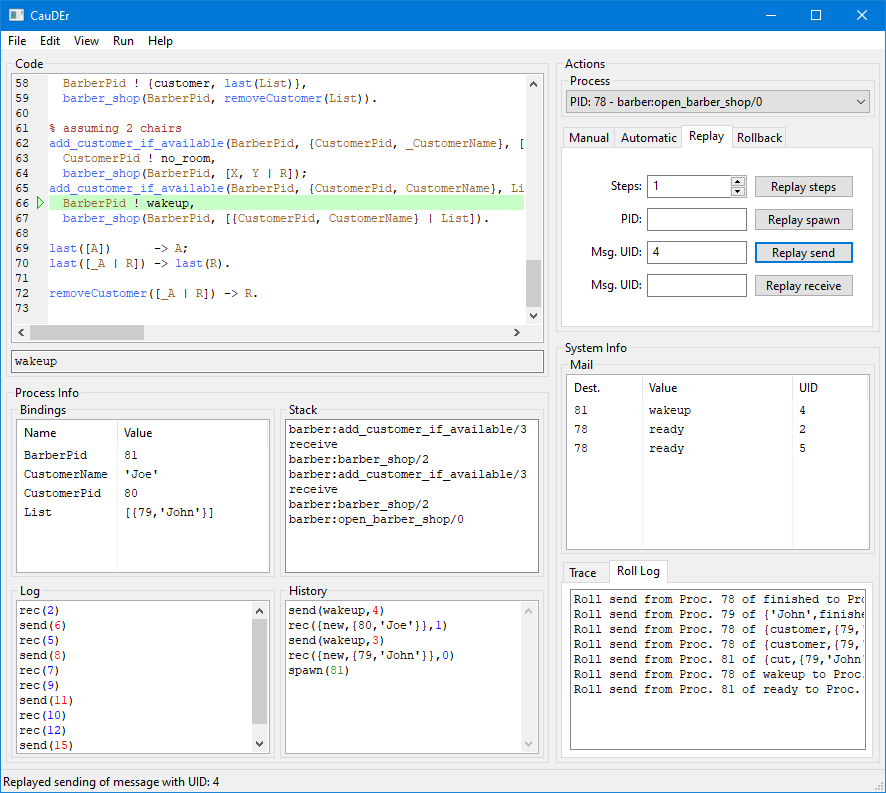

# CauDEr

A Causal-Consistent Reversible Debugger for Erlang




## Dependencies

* **Erlang/OTP** ≥ 23.0
* **Rebar3** (Optional)
* **Make**


## Building

You can use the following `make` tasks to build CauDEr:

* Create _escript_: `make` (or `make escriptize`)
* Compile only: `make compile`
* Build documentation: `make edoc`
* Run dialyzer: `make dialyzer`
* Cleanup: `make clean`


## Running

You can run CauDEr in multiple ways:

### Using the Erlang shell

Using `rebar3 shell` will start a shell with all the required dependencies.

There are multiples ways to run CauDEr:

#### Like an _escript_

Calling the function `cauder:main/0` will start CauDEr like the _escript_.

```
Eshell V11.0  (abort with ^G)
1> cauder:main().
ok
```

ℹ️ This function will wait for the GUI to close before returning, which means the shell will be blocked.

#### Like an application

```
Eshell V11.0  (abort with ^G)
1> application:start(wx), application:start(cauder).
ok
```

ℹ️ To stop CauDEr you can use `application:stop(cauder)`, but it is not necessary if you just close the window.

#### Manually

##### Debugger only

To start the debugger only you can call the following function:

```
Eshell V11.0  (abort with ^G)
1> cauder:start(). % Starting the debugger
{ok,<0.80.0>}
```

##### Debugger and GUI

To start the debugger and the GUI you will need to call the following functions in order:

```
Eshell V11.0  (abort with ^G)
1> cauder:start(). % Starting the debugger
{ok,<0.80.0>}
2> cauder_wx:start(). % Starting the GUI
{ok,<0.82.0>,{wx_ref,35,wxFrame,<0.82.0>}}
```

⚠️ If you try to start the GUI without previously starting the debugger, it will fail with the following error: `{error,{not_started,cauder}}`


#### Using the _escript_

Simply run the `cauder` binary generated in the `_build/default/bin` folder:

```shell script
./_build/default/bin/cauder
```

## Usage

For more information about how to use CauDEr you can check the [Wiki](https://github.com/mistupv/cauder-v2/wiki) (Under construction!)

## License

See [LICENSE](LICENSE) file.
